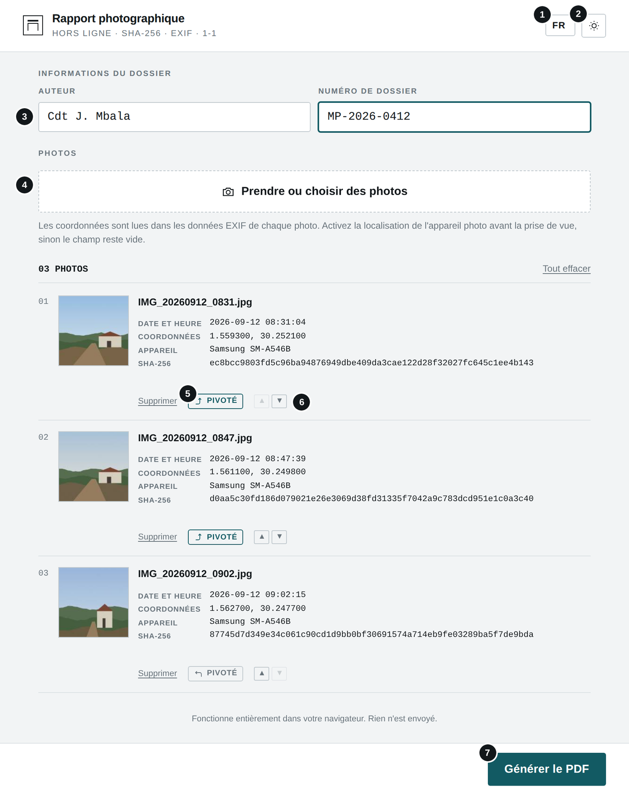
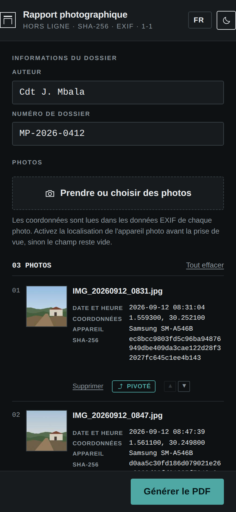
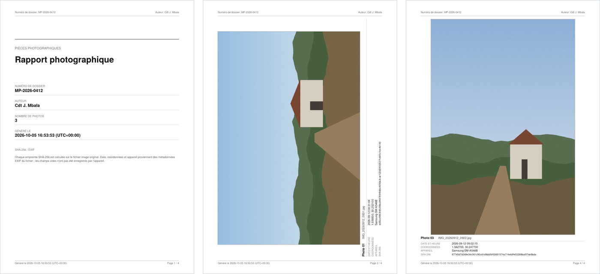
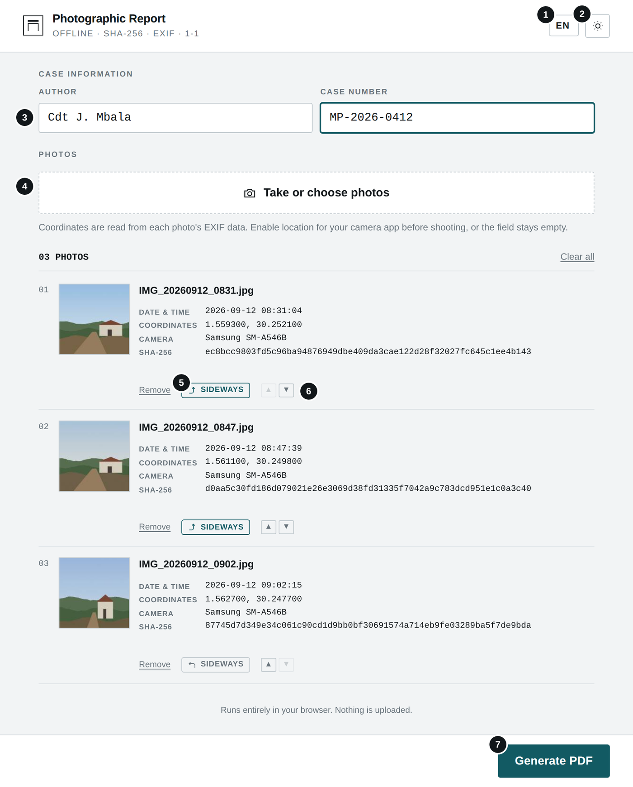
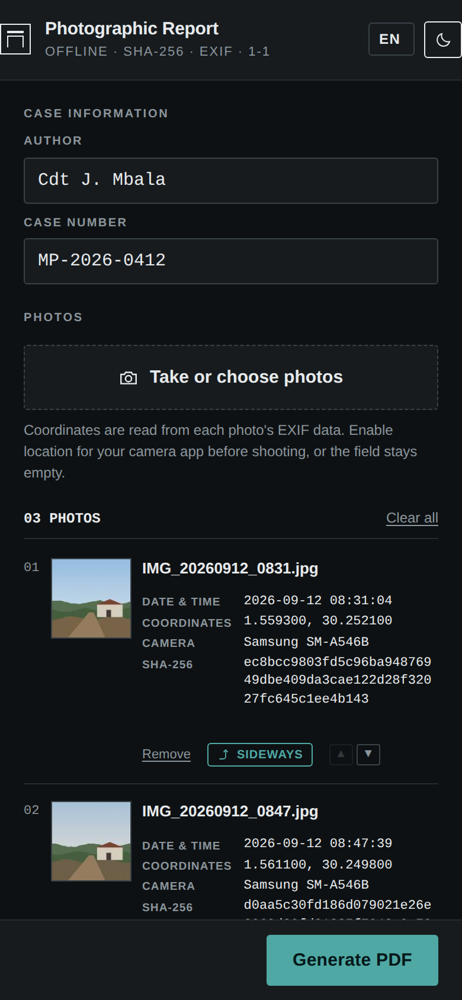

# EXIF Stamper

**`EXIF_STAMPER.html`** · Hors ligne · Aucune installation · Aucun envoi — *Offline · No install · No upload*

**[Français](#français) · [English](#english)**

---

## Français

### À quoi sert cet outil

Cet outil lit la date, l'heure, les coordonnées GPS et le modèle d'appareil enregistrés dans les photos (métadonnées EXIF) et les incruste de façon visible dans l'image. Les informations de prise de vue restent ainsi lisibles, même si la photo est ensuite partagée par une messagerie qui supprime les métadonnées.

### Avant de commencer

- Ouvrez le fichier EXIF_STAMPER.html par double-clic : il s'affiche dans votre navigateur (Chrome, Edge, Firefox ou Safari récents). Aucune installation n'est nécessaire.
- L'outil fonctionne sans connexion Internet. Aucun fichier n'est envoyé : tout le traitement se fait sur votre appareil.
- La langue (FR, EN, SW, LN) se choisit en haut à droite ; le bouton voisin bascule entre thème clair et sombre. Ces choix sont mémorisés.

### L'écran en un coup d'œil

1. Choisir ou déposer des images (JPEG ou TIFF)
2. Réglages du tampon : position, taille, couleur, opacité, marge, qualité
3. Informations à incruster
4. « Aperçu » : contrôler le résultat avant de télécharger
5. « Copier coord. » et lien Google Maps (Internet requis pour la carte)
6. CSV : tableau des métadonnées de toutes les images (« Tout copier » les copie)
7. Tamponner et tout télécharger

#### Sur téléphone (thème sombre)

### Utilisation pas à pas

1. Ajoutez une ou plusieurs photos (JPEG ou TIFF).
2. Contrôlez les informations lues pour chaque photo. La mention « Sans EXIF » signale une image sans métadonnées : elle ne peut pas être tamponnée.
3. Réglez le tampon : position, taille de police, couleur du texte, opacité du fond, marge et qualité. Cochez les informations à afficher.
4. Cliquez sur « Aperçu » pour contrôler le rendu, puis sur « Télécharger » pour une image, ou sur « Tamponner et tout télécharger » pour l'ensemble.
5. Les images sont enregistrées avec le suffixe _stamped. Le fichier original n'est jamais modifié.

### Résultat

*Image tamponnée (réglages par défaut : en bas à droite, texte blanc sur fond semi-transparent).*

### Bonnes pratiques

- Le tampon est une copie visuelle : conservez toujours l'original. L'image tamponnée est un nouveau fichier, sans métadonnées EXIF et avec une empreinte différente ; elle ne remplace pas l'original comme pièce.
- Pour un tirage papier, choisissez la qualité « Haute ».
- Lors d'un téléchargement groupé, le navigateur peut demander l'autorisation d'enregistrer plusieurs fichiers : acceptez.

### En cas de problème

| Problème | Solution |
|---|---|
| **« Sans EXIF »** | La photo a transité par une messagerie ou est une capture d'écran. Utilisez le fichier original de l'appareil. |
| **Photo d'iPhone (HEIC) non lue** | Réglez l'appareil photo sur « Le plus compatible » (JPEG) ou convertissez l'image en JPEG. |
| **Tampon trop petit ou trop grand** | Ajustez la taille de police : elle s'adapte à la largeur de l'image. |
| **Seules certaines images sont téléchargées** | Autorisez les téléchargements multiples pour ce fichier dans le navigateur, puis relancez. |

### Confidentialité

L'outil fonctionne entièrement sur votre appareil, sans connexion Internet. Aucune donnée n'est transmise ni conservée en dehors des fichiers que vous téléchargez vous-même.

---

## English

### What this tool is for

This tool reads the date, time, GPS coordinates and camera model stored in photos (EXIF metadata) and burns them visibly into the image. The capture information stays readable even if the photo is later shared through a messaging app that strips metadata.

### Before you start

- Double-click EXIF_STAMPER.html: it opens in your browser (recent Chrome, Edge, Firefox or Safari). Nothing to install.
- The tool works without an Internet connection. No file is uploaded: everything is processed on your device.
- Choose the language (FR, EN, SW, LN) at the top right; the button next to it switches between light and dark theme. Both choices are remembered.

### The screen at a glance

1. Choose or drop images (JPEG or TIFF)
2. Stamp settings: position, size, colour, opacity, padding, quality
3. Information to stamp
4. “Preview”: check the result before downloading
5. “Copy coords” and Google Maps link (Internet needed for the map)
6. CSV: metadata table for all images (“Copy all” copies it)
7. Stamp & download all

#### On a phone (dark theme)

### Step by step

1. Add one or more photos (JPEG or TIFF).
2. Check the information read from each photo. “No EXIF” marks an image without metadata: it cannot be stamped.
3. Set up the stamp: position, font size, text colour, background opacity, padding and quality. Tick the information to show.
4. Click “Preview” to check the result, then “Download” for one image, or “Stamp & download all” for every image.
5. Images are saved with the _stamped suffix. The original file is never modified.

### Result

*Stamped image (default settings: bottom right, white text on a semi-transparent background).*

### Good practice

- The stamp is a visual copy: always keep the original. The stamped image is a new file, without EXIF metadata and with a different hash; it does not replace the original as evidence.
- For printing, choose “High” quality.
- When downloading several images, the browser may ask permission to save multiple files: accept.

### Troubleshooting

| Problem | Solution |
|---|---|
| **“No EXIF”** | The photo went through a messaging app or is a screenshot. Use the camera's original file. |
| **iPhone photo (HEIC) not read** | Set the camera to “Most Compatible” (JPEG) or convert the image to JPEG. |
| **Stamp too small or too large** | Adjust the font size: it scales with the image width. |
| **Only some images download** | Allow multiple downloads for this file in the browser, then try again. |

### Privacy

The tool runs entirely on your device, without an Internet connection. No data is sent or kept anywhere other than the files you download yourself.
